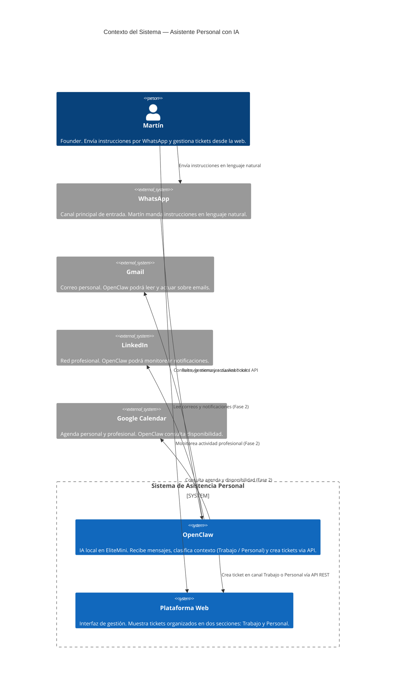

# C4 Nivel 1 — Contexto del Sistema
> Asistente Personal con IA · Martín Cuevas Tavizón · Abril 2026

---

## Descripción del sistema

Sistema de gestión personal + profesional que usa **OpenClaw** (IA local en EliteMini) como cerebro central. El usuario interactúa con el sistema principalmente via **WhatsApp**: manda una instrucción en lenguaje natural, OpenClaw la entiende, clasifica si es de Trabajo o Personal, y crea un ticket estructurado en la **Plataforma Web**. El usuario gestiona y consulta sus tickets desde esa plataforma.

---

## Diagrama de Contexto (C4 Level 1)



---

## Elementos del sistema

### Personas

| Persona | Rol | Canales de interacción |
|---|---|---|
| **Martín** | Usuario único. Founder. | WhatsApp (entrada) · Plataforma Web (gestión) |

### Sistemas internos

| Sistema | Ubicación | Responsabilidad |
|---|---|---|
| **OpenClaw** | EliteMini (MINISFORUM UM890 Pro) — homelab | Recibe mensajes → entiende la intención → clasifica contexto → llama a la API de la Plataforma Web para crear el ticket |
| **Plataforma Web** | DigitalOcean Droplet (nyc3) | Almacena tickets · Muestra vista Trabajo / Personal · Permite actualizar estado · Expone API REST que OpenClaw consume |

### Sistemas externos

| Sistema | Tipo | Estado en MVP |
|---|---|---|
| **WhatsApp** | Canal de entrada | **Activo — MVP** |
| **Google Calendar** | Contexto de agenda | Fase 2 |
| **Gmail** | Canal de correo | Fase 2 |
| **LinkedIn** | Canal profesional | Fase 2 |

---

## Flujo principal — MVP

```
Martín
  │
  │  "Necesito preparar propuesta para el cliente X para el jueves"
  │  (mensaje de WhatsApp)
  ▼
WhatsApp
  │
  │  webhook / polling
  ▼
OpenClaw (EliteMini — local)
  │
  │  1. Entiende la instrucción en lenguaje natural
  │  2. Clasifica contexto: TRABAJO
  │  3. Extrae: título, acción concreta, fecha, prioridad
  │
  │  POST /api/tickets  { context: "TRABAJO", title: "...", ... }
  ▼
Plataforma Web (DigitalOcean)
  │
  │  Guarda ticket en DB
  │  Ticket aparece en sección TRABAJO
  ▼
Martín (abre la plataforma web)
  └── Ve el ticket estructurado listo para ejecutar
```

---

## Límites del sistema — MVP vs Fases

| Capacidad | MVP | Fase 2 |
|---|---|---|
| Recibir instrucciones por WhatsApp | ✅ | ✅ |
| Clasificar Trabajo / Personal | ✅ | ✅ |
| Crear ticket estructurado en la web | ✅ | ✅ |
| Vista web Trabajo / Personal | ✅ | ✅ |
| Leer Gmail y actuar sobre correos | ❌ | ✅ |
| Consultar Google Calendar | ❌ | ✅ |
| Monitorear LinkedIn | ❌ | ✅ |
| Responder por WhatsApp al usuario | ❌ | ✅ |

---

## Decisiones de arquitectura — nivel contexto

| Decisión | Razón |
|---|---|
| OpenClaw en EliteMini (local, no nube) | Privacidad de datos · Sin costo de inferencia por llamada · Latencia baja en red local |
| WhatsApp como canal principal | Es donde Martín ya vive — cero fricción de adopción |
| Plataforma Web en DigitalOcean | Accesible desde cualquier lugar · Deploy simple · Costo < $15/mes |
| DB en DigitalOcean Managed Database | Sin dependencia de Supabase · Un proveedor para todo · Backup automático incluido |
| Dos contextos fijos: Trabajo / Personal | Clasificación binaria → decisiones más rápidas, sin ambigüedad |
