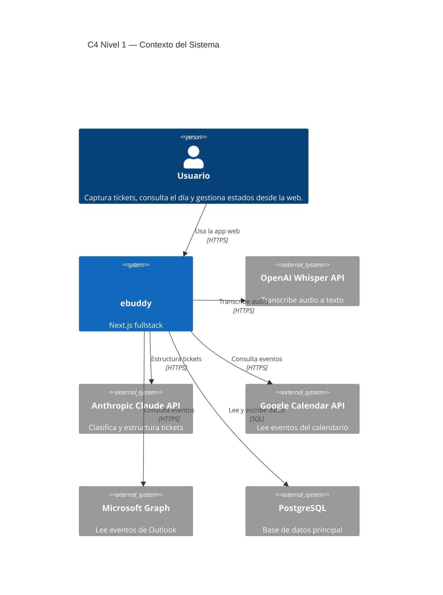

# C4 Nivel 1 — Contexto del Sistema

> Representación del sistema actual del repositorio.

---

## Descripción

ebuddy es una aplicación web fullstack para capturar, organizar y ejecutar
tickets personales y de negocio. El usuario interactúa por navegador y la app
se integra con proveedores externos de IA y calendario. La persistencia usa
PostgreSQL con Drizzle ORM y la identidad de usuario se gestiona con `next-auth`.

---

## Diagrama

---

## Elementos

| Elemento | Rol |
|---|---|
| Usuario | Usa la app desde navegador |
| ebuddy | Sistema central |
| PostgreSQL + Drizzle | Persistencia y acceso a datos |
| OpenAI Whisper | Transcripción de audio |
| Anthropic Claude | Estructuración y clasificación |
| Google Calendar / Microsoft Graph | Lectura de agenda |

---

## Notas

- La autenticación de usuario ocurre dentro de ebuddy usando `next-auth`.
- El frontend no llama proveedores externos directamente.
- Toda integración externa pasa por la app.
