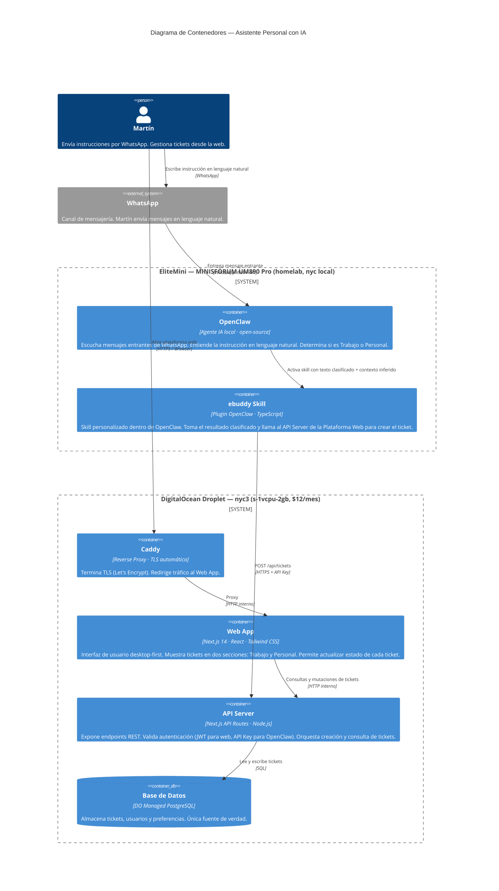

# C4 Nivel 2 — Contenedores
> Asistente Personal con IA · Martín Cuevas Tavizón · Abril 2026

---

## Diagrama de Contenedores



---

## Descripción de cada contenedor

### EliteMini (homelab)

| Contenedor | Tecnología | Responsabilidad |
|---|---|---|
| **OpenClaw** | Agente IA local · open-source | Recibe mensajes de WhatsApp. Interpreta la instrucción en lenguaje natural. Infiere si el tema es **Trabajo** o **Personal**. Extrae título, acción concreta y prioridad. |
| **ebuddy Skill** | Plugin de OpenClaw · TypeScript | Skill personalizado. Recibe el resultado procesado por OpenClaw y llama al endpoint `POST /api/tickets` de la Plataforma Web con la API Key del usuario. |

### DigitalOcean Droplet

| Contenedor | Tecnología | Responsabilidad |
|---|---|---|
| **Caddy** | Reverse proxy | Termina TLS automáticamente con Let's Encrypt. Redirige todo el tráfico a la Web App. |
| **Web App** | Next.js 14 · React · Tailwind CSS | Interfaz desktop-first. Vista **Trabajo** y vista **Personal**. Muestra tickets con título, acción concreta, pasos siguientes y prioridad. Permite cambiar estado (Pendiente → En Progreso → Hecho). |
| **API Server** | Next.js API Routes · Node.js | Punto de entrada de toda la lógica de negocio. Valida autenticación. Procesa creación y consulta de tickets. Expone los endpoints que consumen tanto la Web App como el ebuddy Skill de OpenClaw. |
| **Base de Datos** | DO Managed PostgreSQL | Almacena todas las entidades. Backups automáticos. Sin dependencia de Supabase. |

---

## Endpoints principales del API Server

| Método | Endpoint | Quién lo llama | Para qué |
|---|---|---|---|
| `POST` | `/api/tickets` | ebuddy Skill (OpenClaw) · Web App | Crear ticket nuevo |
| `GET` | `/api/tickets` | Web App | Listar tickets (filtrar por contexto, estado, fecha) |
| `PATCH` | `/api/tickets/:id` | Web App | Actualizar estado del ticket |
| `DELETE` | `/api/tickets/:id` | Web App | Eliminar ticket |
| `GET` | `/api/health` | DO Monitoring | Health check del servidor |

---

## Autenticación — dos caminos

```
Martín (browser)                     OpenClaw (ebuddy Skill)
       │                                      │
       │  email + password                    │  API Key estática
       │  → JWT (cookie httpOnly)             │  → Header: Authorization: Bearer ebdy_live_...
       ▼                                      ▼
            API Server — Auth Middleware
                  │
                  ├── JWT válido → identifica userId → procesa request
                  └── API Key válida (hash en DB) → identifica userId → procesa request
```

---

## Flujo completo — MVP

```
1. Martín escribe en WhatsApp:
   "Tengo que preparar la propuesta para el cliente García, es para el viernes"

2. OpenClaw recibe el mensaje
   → Entiende: tarea profesional, tiene deadline
   → Clasifica: TRABAJO
   → Extrae:
       title:       "Preparar propuesta cliente García"
       what_to_do:  "Redactar y enviar propuesta antes del viernes"
       next_steps:  ["Revisar requisitos del cliente", "Armar deck", "Enviar por email"]
       priority:    ALTA
       due_date:    viernes (fecha calculada)

3. ebuddy Skill llama al API Server:
   POST https://app.ebuddy.io/api/tickets
   Authorization: Bearer ebdy_live_xxxxx
   {
     "context":    "TRABAJO",
     "title":      "Preparar propuesta cliente García",
     "what_to_do": "Redactar y enviar propuesta antes del viernes",
     "next_steps": [...],
     "priority":   "ALTA",
     "due_date":   "2026-04-18"
   }

4. API Server guarda el ticket en PostgreSQL

5. Martín abre la Plataforma Web
   → Sección TRABAJO → ve el ticket listo para ejecutar
```

---

## Restricciones de diseño

| Restricción | Razón |
|---|---|
| EliteMini debe estar **siempre encendido** para que WhatsApp funcione | WhatsApp Web requiere sesión activa en la máquina local |
| Si el EliteMini se apaga, la **Plataforma Web sigue disponible** | La web está en DO, no depende del homelab |
| La API Key de OpenClaw **nunca viaja al browser** | Solo la usa el ebuddy Skill en el EliteMini |
| La DB está en **DO Managed** (no self-hosted) | Backups automáticos, sin mantenimiento de instancia |

---

## Decisiones pendientes (antes de implementar)

| Decisión | Opciones | Estado |
|---|---|---|
| ¿Cómo conecta OpenClaw a WhatsApp? | WhatsApp Business API (Meta) vs WhatsApp Web unofficial (Baileys) | Por definir |
| ¿Modelo de IA dentro de OpenClaw? | Local (Ollama + Llama/Mistral) vs API externa (Claude/GPT) | Por definir |
| ¿Cómo hace Martín login en la web? | Email + password vs OAuth Google | Por definir |
| Nombre final del sistema | ebuddy vs nuevo nombre | Por definir |
