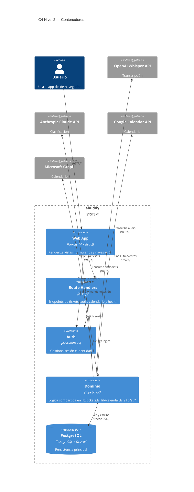

# C4 Nivel 2 — Contenedores

> Contenedores lógicos del sistema actual.

---

## Diagrama

---

## Contenedores

| Contenedor | Tecnología | Responsabilidad |
|---|---|---|
| Web App | Next.js + React | UI y experiencia del usuario |
| Route Handlers | Next.js | Exposición de APIs internas |
| Auth | `next-auth` | Sesiones e identidad |
| Dominio | TypeScript | Tickets, calendario e IA |
| Base de Datos | PostgreSQL + Drizzle | Persistencia |

---

## Mapeo al repo

| Contenedor | Ubicación principal |
|---|---|
| Web App | `app/`, `components/` |
| Route Handlers | `app/api/` |
| Auth | `lib/auth/`, `middleware.ts` |
| Dominio | `lib/tickets.ts`, `lib/calendar.ts`, `lib/ai/` |
| Base de Datos | `lib/db/`, `drizzle/` |
